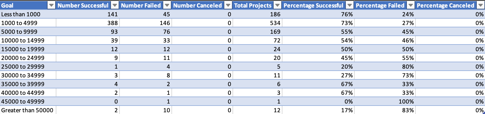
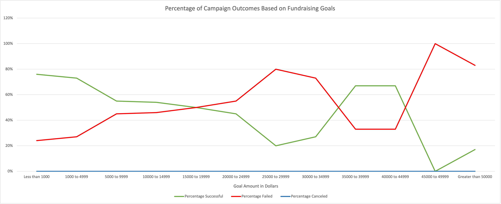

# Kickstarting with Excel

## Overview of Project

### Purpose

This project was intended to analyze the outcomes of Kickstarter campaigns in relation to their launch dates and their funding goals. The analysis's client, a playwright, is interested in funding theatrical plays, and so the analysis looks specifically at Kickstarter campaigns classified as funding theatrical projects. 

## Analysis and Challenges

### Analysis of Outcomes Based on Launch Date

I first created a pivot table using all of the available Kickstarter data. The table listed the possible campaign outcomes (successful, failed, or canceled) as columns, and counted the number of occurrences of each outcome for every month. I then filtered the data to focus on campaigns classified in the Theater parent category.

That data informed the following chart:

Across all of the years from which data was taken, the number of successful campaigns for plays saw its peak in the month of May. The number of failed campaigns shows smaller peaks in May and October, and the number of canceled campaigns shows relatively little change throughout the year, with all of its values below 10.

While the increase in successful campaigns in May could be caused by the total number of Kickstarters increasing, it seems more likely related to an actual increase in the success rate of campaigns; while successful campaigns show peaks that temporally match the peaks of failed campaigns, the peak of successful campaigns in May is far greater than other smaller peaks.

### Analysis of Outcomes Based on Goals

I then moved on to examine campaign outcomes in relation to their fundraising goals. Unlike that above analysis, I focused on specifically on campaigns for plays, rather than all theatrical projects. The campaigns were categorized by goal amount and sorted into groups. The first group counts all campaigns with goals under $1000, the second counts camapaign goals between $1000 and $4,999, and each group after begins with the next multiple of $5000 ($5,000-$9,999, $10,000-$14,999, etc.). The last group counts all campaigns with goals over $50,000.

The percentage of successes, failures, and cancellations was then calculated for each goal group.

This table data informed the following chart focusing on the percentages:

Notably, the data contains play campaigns that were canceled. 

### Challenges and Difficulties Encountered

## Results

Based on the analysis of Outcomes Based on Launch Date, I can conclude that 1) May is the optimal month to launch a Kickstarter campaign for a play, and 2) the number of canceled campaigns is unrelated to the month in which the campaigns are launched.

Based on the analysis of Outcomes Based on Goals, I can conclude that a goal of around $15,000 is the maximum fundraising goal before the chances of success begin to drop below 50%. Although the success rate rises above 50% for goals between $35,000 and $45,000, there may be other reasons for that besides goal amount, and the surrounding goal groups have far lower success rates. To have a more reliable chance of success, a campaign goal should be in the $1,000 to $5,000 range.

The dataset lacks some details that could potentially inform further analysis. There is no immediately available measure of how long campaigns were active or how long it took successful campaigns to reach their goals. The "Plays" subcategory of data could be further categorized into types of genres, which could let us find not only how plays perform on Kickstarter, but how different types of plays perform on Kickstarter. Finally, the dataset doesn't take into account outside factors that could affect the success or failure of campaigns, such as time and money spent on marketing.

For further analysis, we could calculate the length of time each campaign was active, and examine that in relation to the outcomes of those campaigns. We could also analyze each campaign's number of backers and average donation in relation to the campaign's outcome.
