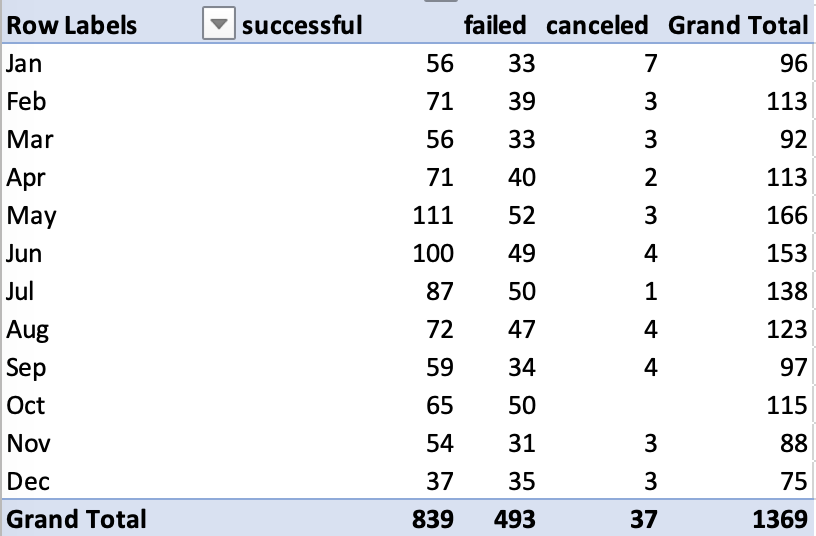
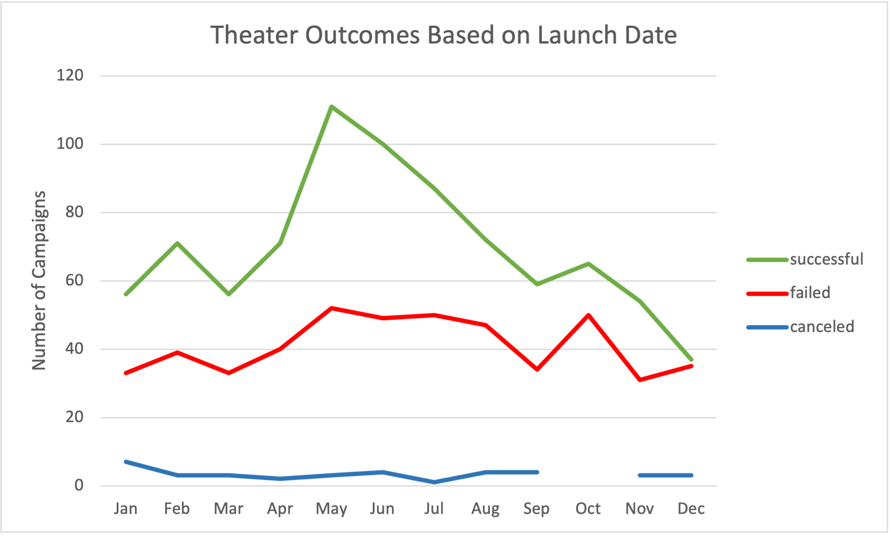

# Kickstarting with Excel

## Overview of Project

### Purpose

This project was intended to analyze the outcomes of Kickstarter campaigns in relation to their launch dates and their funding goals. The analysis's client, a playwright, is interested in funding theatrical plays, and so the analysis looks specifically at Kickstarter campaigns classified as funding those kinds of projects. 

## Analysis and Challenges

### Analysis of Outcomes Based on Launch Date

I first created a pivot table using all of the available Kickstarter data. The table listed the possible campaign outcomes (successful, failed, or canceled) as columns, and counted the number of occurrences of each outcome for every month. I then filtered the data to focus on campaigns classified in the Theater parent category.
---

---
That data informed the following chart:
---

---

### Analysis of Outcomes Based on Goals

### Challenges and Difficulties Encountered

## Results

- What are two conclusions you can draw about the Outcomes based on Launch Date?

- What can you conclude about the Outcomes based on Goals?

- What are some limitations of this dataset?

- What are some other possible tables and/or graphs that we could create?
